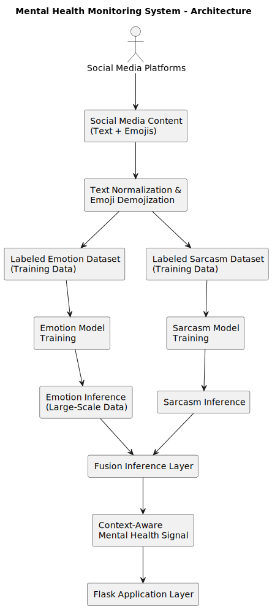

# 🧠 Mental Health Monitoring on Social Media
### An NLP System Combining Emotion and Sarcasm Signals for Context-Aware Analysis

---

## 🧩 Problem Statement

Social media platforms generate massive volumes of user-generated content that often reflect emotional distress, psychological patterns, and behavioral shifts. While this data presents an opportunity for large-scale mental health signal monitoring, accurately interpreting such content remains challenging.

A major limitation of traditional text-based approaches is their inability to distinguish between **literal emotional expression** and **sarcastic or ironic language**, which is common in online communication. Emotion-only models may misclassify sarcastic statements, while sarcasm detection alone lacks emotional context.

This project addresses this gap by designing a system that jointly analyzes **emotional tone** and **sarcasm cues**, enabling more context-aware interpretation of mental health signals from social media content.

---

## 🧠 System Overview

To address the limitations of single-perspective text analysis, this system is designed as a **multi-stage NLP pipeline** that analyzes social media content from complementary viewpoints.

The workflow consists of three core stages:
1. **Emotion analysis**, which captures the underlying emotional tone expressed in the content.
2. **Sarcasm analysis**, which identifies ironic or non-literal language that can distort emotion interpretation.
3. **Fusion inference**, which integrates outputs from both analyses to produce a more context-aware mental health signal.

By separating emotion and sarcasm modeling while combining their outputs at the decision level, the system balances interpretability with contextual accuracy, making it suitable for large-scale social media analysis.

## 🧠 System Architecture

---

## 📓 Notebooks Used

The core logic of the system is implemented across **three Jupyter notebooks**:

- `01_data_loading-restored.ipynb` – data preparation and preprocessing  
- `02_sarcasm_detection.ipynb` – sarcasm classification pipeline  
- `03_fusion_inference.ipynb` – fusion logic and final inference  

These notebooks collectively define the **end-to-end learning and inference workflow**.

---

## 🔁 Reproducibility & Design Philosophy

- The repository focuses on **clarity, structure, and reproducibility**
- All learning and inference logic is captured in notebooks
- Dependencies are explicitly defined for consistent execution
- Version control is used to track **system evolution**, not data storage

---

## 🛠️ Tech Stack

- Python  
- Transformers (DistilBERT)  
- Scikit-learn  
- Pandas, NumPy  
- Flask  
- Jupyter Notebook  

---

## 🎯 Potential Applications

- Mental health trend monitoring  
- Social media behavior analysis  
- Emotion–sarcasm interaction studies  
- NLP system design demonstrations  

---

## 👤 Author

**Vignesh Pothu**  
Computer Science | Machine Learning & NLP

\## Note

Datasets, training splits, and trained models are intentionally excluded

from this repository.

